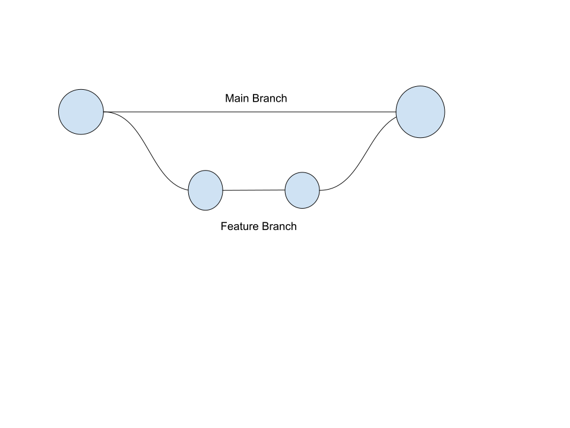

# Lab Report: Requirements
___
**Course:** CIS 411, Spring 2022  
**Instructor(s):** [Trevor Bunch](https://github.com/trevordbunch)  
**Name:** Jamie Padovano  
**GitHub Handle:** JPadovano1483
**Repository:** https://github.com/JPadovano1483/cis411_lab0_req  
___

## 1. Overview
The problem we are solving is that we would like to be able to order food from an on-campus provider and have it delivered to our classroom. This use case diagram models the relationships between the client, who is ordering and paying for their food, the employees, who both cook and deliver the food, and the boss, who manages the employees. The client orders and pays for their food, then the cook receives the order and cooks the food. Another employee takes the food and delivers it to the client in their classroom. The boss oversees and manages the cooks and other employees.


## 2. Requirements
### Business
   
   - B.1 -  Must keep and graph data from order times, using it to determine what times are busier for orders and schedule employees accordingly (Gordon Ramsay)

   - B.2 - Must post the afore mentioned data to the page so users can see when the busiest times occur (Gordon Ramsay)

   - B.3 - Must make the cafe a profit of at least 20% (Noel Laven)


### User
   - U.1 - Must have a school email (ending with @messiah.edu) (Peter Parker)
   - U.2 - Must place order, make payment, and specify what building and room to deliver to (Gordon Ramsay)
   - U.3 - Must allow a minimum wait time of 25 minutes (Peter Parker)


### Functional
   - F.1 - Must inform user of any issues with their order (i.e. out of an item, longer delivery time than expected, issue with payment, etc.) (Peter Parker)
   - F.2 - Must send confirmation email with a receipt, including the items that were purchased, cost (per item and total), and expected delivery time (Gordon Ramsay)
   - F.3 - Must allow user to input any dietary restrictions and refresh the menu options to reflect what they can eat (Justin Wood)


### Non-Functional
   - NF.1 - Page must send order to the cafe within 5 seconds of user hitting submit (Noel Laven)
   - NF.2 - Must be available during hours of operation of the cafe (Gordon Ramsay)
   - NF.3 - Layout must be easy to follow and use (Peter Parker)
   - NF.4 - Must only accept orders from users with a school email (Gordon Ramsay) 


### System
   - S.1 - The system must be built using Messiah servers (Peter Parker)
   - S.2 - The system must use Messiah's CAS system to verify users and sign them in (Peter Parker)
   - S.3 - The system will be built off of the pre-existing Union and Falcon online ordering websites (Gordon Ramsay)

## Appendix: GitHub Notes

### A.1 Forked Repository
This diagram demonstrates the relationship between  the source repository and my forked repository.


### A.2 Git Logs
```
7c0bf52 (HEAD -> main, labreport) Final lab report

b387c46 (origin/labreport) Almost finished with the lab report @trevordbunch

fb10f52 you commit and reference @trevordbunch in the message

50d40f8 (upstream/main, origin/main, origin/HEAD) Update references to main branch

ef962b1 Fix links in resource area
237b52e Update Instructions for template file
dafaf5e Merge pull request #2 from NedacNostrebor/patch-1
6293806 Merge pull request #1 from mcjo163/main
7482f04 Typo in lab instructions
3080719 typo in readme
33efb41 formatted template
fd13d03 initial draft
ad87871 Create License

```

### A.3 Branch Repository
This diagram models the relationship between my main branch and feature branch in my reposirtory.

